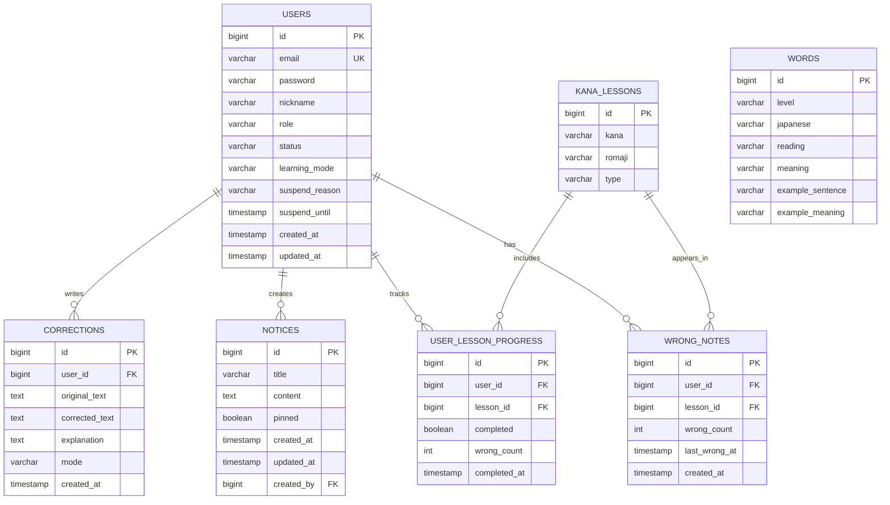

# NihonGO ERD

NihonGO 백엔드의 실제 JPA Entity를 기준으로 정리한 데이터베이스 문서입니다.

## 테이블 목록

| 테이블 | Entity | 설명 |
| --- | --- | --- |
| `users` | `User` | 회원 계정, 권한, 상태, 학습 목적 모드 |
| `notices` | `Notice` | 공지사항 |
| `corrections` | `Correction` | AI 일본어 교정 기록 |
| `kana_lessons` | `KanaLesson` | 히라가나/가타카나 학습 콘텐츠 |
| `user_lesson_progress` | `UserLessonProgress` | 사용자별 레슨 진행 상태 |
| `wrong_notes` | `WrongNote` | 사용자별 오답노트 |
| `words` | `Word` | JLPT 단어 콘텐츠 |

## 컬럼 목록

### users

| 컬럼 | 타입 | 제약 | 설명 |
| --- | --- | --- | --- |
| `id` | `BIGINT` | PK, Auto Increment | 사용자 ID |
| `email` | `VARCHAR(100)` | NOT NULL, UNIQUE | 로그인 이메일 |
| `password` | `VARCHAR(255)` | NOT NULL | 암호화된 비밀번호 |
| `nickname` | `VARCHAR(50)` | NOT NULL | 닉네임 |
| `role` | `VARCHAR(20)` | NOT NULL, default `USER` | 사용자 권한 (`USER`, `ADMIN`) |
| `status` | `VARCHAR(20)` | NOT NULL, default `ACTIVE` | 계정 상태 (`ACTIVE`, `SUSPENDED`) |
| `learning_mode` | `VARCHAR(30)` | NOT NULL, default `GENERAL` | 학습 목적 모드 |
| `suspend_reason` | `VARCHAR(255)` | NULL | 정지 사유 |
| `suspend_until` | `TIMESTAMP` | NULL | 정지 종료 시각 |
| `created_at` | `TIMESTAMP` | NOT NULL | 가입 시각 |
| `updated_at` | `TIMESTAMP` | NULL | 수정 시각 |

`learning_mode` 값:

- `GENERAL`
- `JAPAN_JOB`
- `WORKING_HOLIDAY`
- `DAILY_LIFE`
- `JLPT`

### notices

| 컬럼 | 타입 | 제약 | 설명 |
| --- | --- | --- | --- |
| `id` | `BIGINT` | PK, Auto Increment | 공지 ID |
| `title` | `VARCHAR(150)` | NOT NULL | 공지 제목 |
| `content` | `TEXT` | NOT NULL | 공지 내용 |
| `pinned` | `BOOLEAN` | NOT NULL | 상단 고정 여부 |
| `created_at` | `TIMESTAMP` | NOT NULL | 작성 시각 |
| `updated_at` | `TIMESTAMP` | NULL | 수정 시각 |
| `created_by` | `BIGINT` | FK, NOT NULL | 작성자 ID |

### corrections

| 컬럼 | 타입 | 제약 | 설명 |
| --- | --- | --- | --- |
| `id` | `BIGINT` | PK, Auto Increment | 교정 ID |
| `user_id` | `BIGINT` | FK, NOT NULL | 교정을 요청한 사용자 ID |
| `original_text` | `TEXT` | NOT NULL | 원문 |
| `corrected_text` | `TEXT` | NOT NULL | 교정된 문장 |
| `explanation` | `TEXT` | NOT NULL | 교정 설명 |
| `mode` | `VARCHAR(30)` | NOT NULL | 교정 모드 |
| `created_at` | `TIMESTAMP` | NOT NULL | 교정 생성 시각 |

`mode` 값:

- `GENERAL`
- `JOB_INTERVIEW`
- `WORKING_HOLIDAY`
- `DAILY_LIFE`

### kana_lessons

| 컬럼 | 타입 | 제약 | 설명 |
| --- | --- | --- | --- |
| `id` | `BIGINT` | PK, Auto Increment | 레슨 ID |
| `kana` | `VARCHAR(10)` | NOT NULL | 히라가나/가타카나 문자 |
| `romaji` | `VARCHAR(20)` | NOT NULL | 로마자 표기 |
| `type` | `VARCHAR(20)` | NOT NULL | 문자 유형 (`HIRAGANA`, `KATAKANA`) |

### user_lesson_progress

| 컬럼 | 타입 | 제약 | 설명 |
| --- | --- | --- | --- |
| `id` | `BIGINT` | PK, Auto Increment | 진행 ID |
| `user_id` | `BIGINT` | FK, NOT NULL | 사용자 ID |
| `lesson_id` | `BIGINT` | FK, NOT NULL | 레슨 ID |
| `completed` | `BOOLEAN` | NOT NULL | 완료 여부 |
| `wrong_count` | `INTEGER` | NOT NULL | 오답 횟수 |
| `completed_at` | `TIMESTAMP` | NULL | 완료 시각 |

### wrong_notes

| 컬럼 | 타입 | 제약 | 설명 |
| --- | --- | --- | --- |
| `id` | `BIGINT` | PK, Auto Increment | 오답노트 ID |
| `user_id` | `BIGINT` | FK, NOT NULL | 사용자 ID |
| `lesson_id` | `BIGINT` | FK, NOT NULL | 레슨 ID |
| `wrong_count` | `INTEGER` | NOT NULL | 누적 오답 횟수 |
| `last_wrong_at` | `TIMESTAMP` | NOT NULL | 마지막 오답 시각 |
| `created_at` | `TIMESTAMP` | NOT NULL | 최초 생성 시각 |

제약:

- `UNIQUE(user_id, lesson_id)`

### words

| 컬럼 | 타입 | 제약 | 설명 |
| --- | --- | --- | --- |
| `id` | `BIGINT` | PK, Auto Increment | 단어 ID |
| `level` | `VARCHAR(10)` | NOT NULL | JLPT 레벨 |
| `japanese` | `VARCHAR(50)` | NOT NULL | 일본어 단어 |
| `reading` | `VARCHAR(50)` | NOT NULL | 읽는 법 |
| `meaning` | `VARCHAR(100)` | NOT NULL | 한국어 뜻 |
| `example_sentence` | `VARCHAR(255)` | NOT NULL | 예문 |
| `example_meaning` | `VARCHAR(255)` | NOT NULL | 예문 뜻 |

`level` 값:

- `N5`
- `N4`
- `N3`
- `N2`
- `N1`

## 관계 설명

- `users` 1 : N `corrections`
  - 한 사용자는 여러 교정 기록을 작성할 수 있습니다.
- `users` 1 : N `notices`
  - 관리자 사용자는 여러 공지사항을 작성할 수 있습니다.
- `users` 1 : N `user_lesson_progress`
  - 한 사용자는 여러 레슨의 진행 상태를 가질 수 있습니다.
- `kana_lessons` 1 : N `user_lesson_progress`
  - 하나의 레슨은 여러 사용자의 진행 상태와 연결됩니다.
- `users` 1 : N `wrong_notes`
  - 한 사용자는 여러 오답노트를 가질 수 있습니다.
- `kana_lessons` 1 : N `wrong_notes`
  - 하나의 레슨은 여러 사용자의 오답노트와 연결됩니다.
- `words`
  - 현재 Entity 기준으로 다른 테이블과 직접 FK 관계가 없습니다.

## Mermaid ERD

